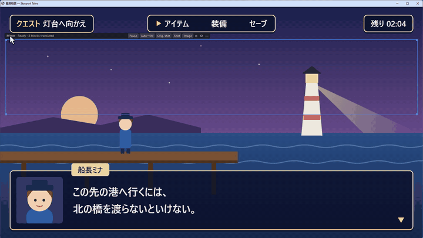
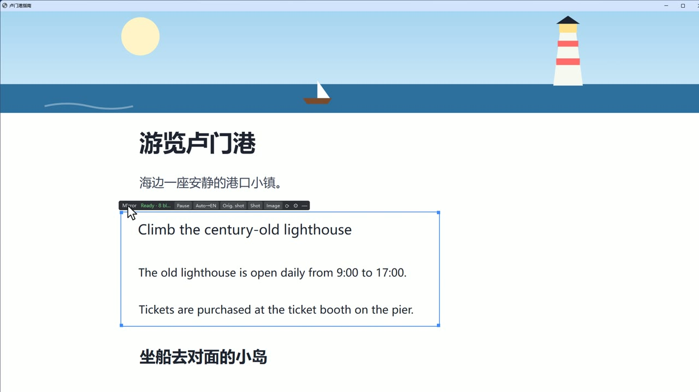
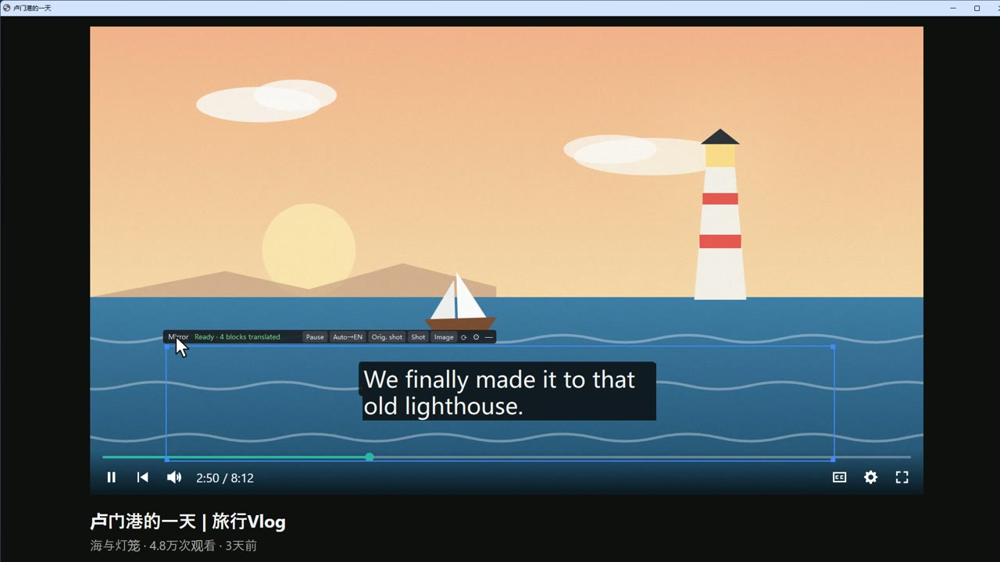
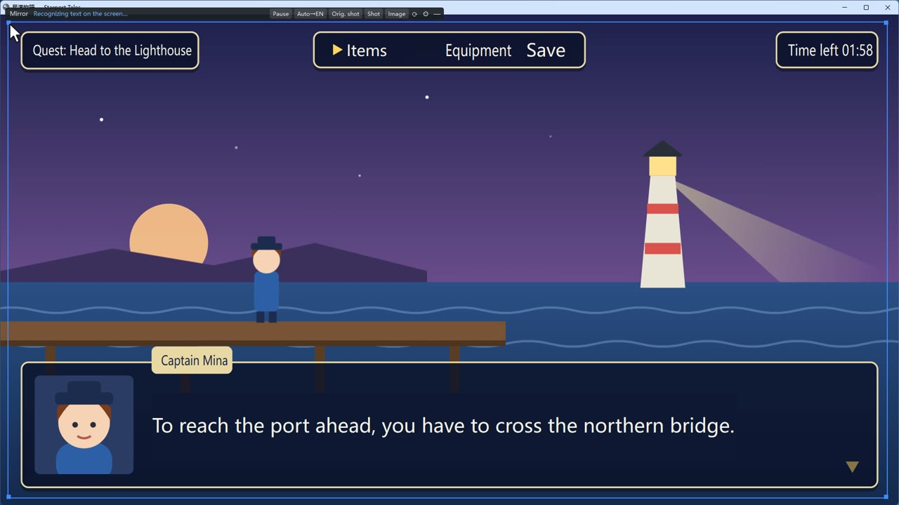
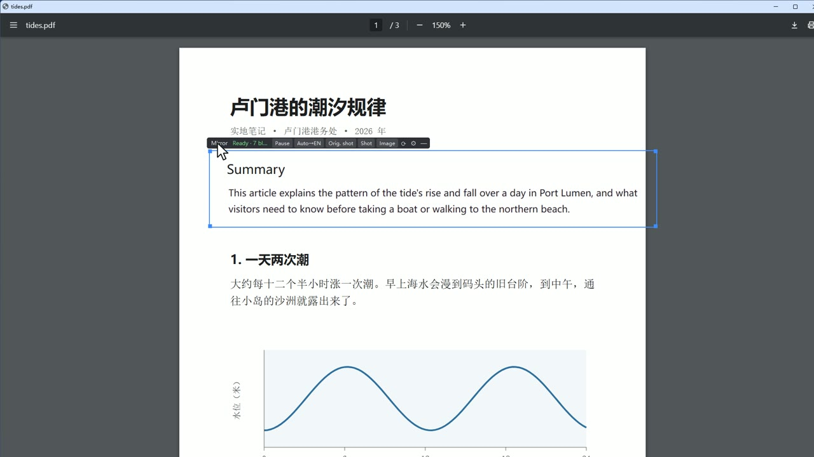
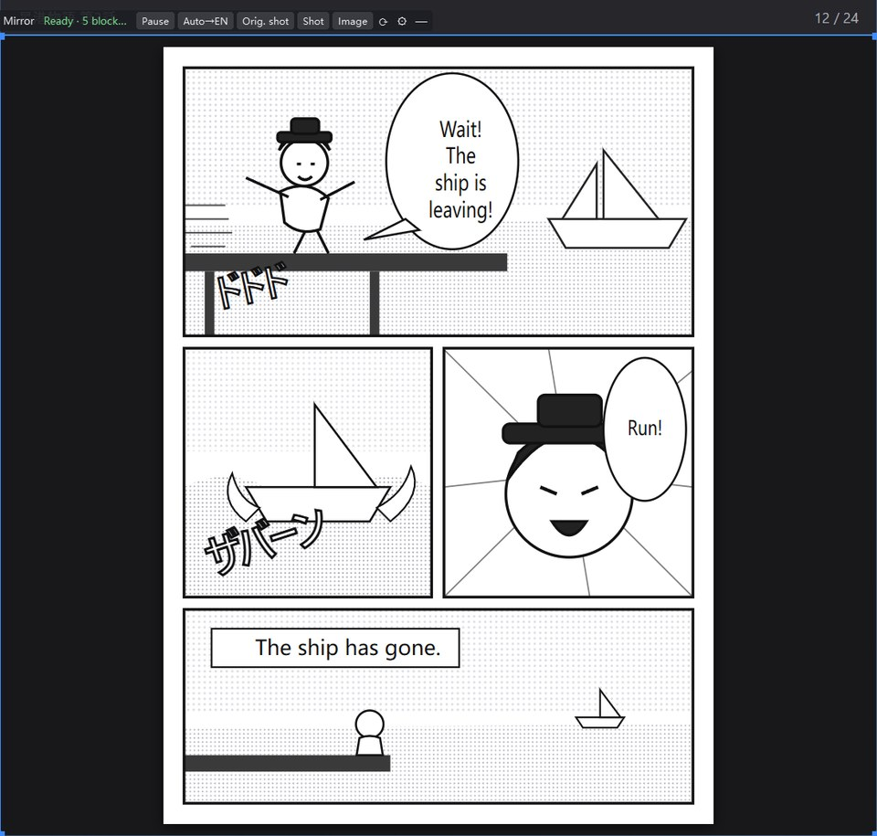

[English](README.md) · [简体中文](README.zh-CN.md) · [繁體中文](README.zh-TW.md) · [日本語](README.ja.md) · **한국어** · [Bahasa Indonesia](README.id.md)

# DeskMirror (데스크미러)

Windows용 화면 번역 도구입니다. 바탕 화면 아무 곳에나 끌어다 놓을 수 있는 '미러'를 두면, 틀 안에서는 같은 위치의 글자가
그 자리에서 번역문으로 바뀌고, 틀 밖은 평소의 바탕 화면 그대로입니다.
웹 페이지, PDF, 앱, 게임, 동영상 자막을 모두 같은 방식으로 번역하며 브라우저 확장 프로그램도 필요 없습니다.



처음이라면 [빠른 시작](docs/QUICKSTART.en.md)(처음 실행할 때도 같은 안내가 열립니다)과 [사용 설명서](docs/GUIDE.en.md)를
읽어 보세요(둘 다 영어이며 중국어판도 있습니다).

## 실제 화면

2분 30초짜리 소개 영상(영어판):

https://github.com/user-attachments/assets/949fc01b-9277-44ab-8253-7a7a5162d22c

프로젝트의 테스트 페이지에서 DeskMirror를 실행한 실제 화면입니다(번역 서비스: DeepSeek. 번역문은 영어이지만, 모국어로
한국어를 고르면 한국어로 표시됩니다).

| 웹 페이지 | 동영상 자막 |
|---|---|
|  |  |
| **창 모드 게임** | **PDF** |
|  |  |

**만화**: 말풍선 안의 세로쓰기 글자를 바로 인식해 그 자리에서 바꿉니다. 말풍선 테두리는 그대로 남습니다.



## 특징

- **제자리 표시**: 번역문은 원문이 있던 자리에, 글자 크기와 색도 최대한 원문에 맞춰 표시됩니다. Ctrl+Alt+O를 누르고 있으면 원문이 보입니다.
- **화면 변화를 따라감**: 스크롤, 창 이동과 겹침, 동영상 자막까지 따라갑니다. 화면이 어떻게 바뀌는지를 보고 판단하므로 특정 프로그램에 의존하지 않습니다.
- **백그라운드에서 미리 번역**: 미러가 있는 화면의 글자를 미리 번역해 두므로, 어디로 끌어도 번역문이 바로 나옵니다. 한 번 번역한 내용은 다시 번역하지 않습니다.
- **번역 서비스 선택**: 로컬 [Ollama](https://ollama.com)(무료, 글자가 PC 밖으로 나가지 않음) 또는 DeepSeek, Qwen, OpenAI 같은 OpenAI 호환 API.
- **개인정보는 직접 관리**: 번역 제외 목록(채팅 앱, 비밀번호 관리자, 인터넷 뱅킹은 기본으로 제외. 외국 동료나 친구와 채팅할 때는 'Translate chat apps'를 클릭 한 번으로 켬), 세 가지 미리 번역 범위, 오늘 사용량 표시. 화면의 글자는 기본적으로 디스크에 저장하지 않습니다.
- **언어는 언제든 전환**: 미러 탭의 언어 버튼(예: 'Auto→KO')으로 원문과 번역 언어를 지정합니다. 중국어, 영어, 일본어, 한국어, 인도네시아어를 지원합니다.
- **영어·중국어 인터페이스**: 처음 실행할 때 모국어를 고르면 번역문이 그 언어로 나옵니다. 화면 표시(UI)는 중국어와 영어만 있어서, 한국어를 고르면 영어가 됩니다. 둘 다 나중에 설정에서 바꿀 수 있습니다.
- **용어집**: 용어집의 번역어는 반드시 쓰이고, 등록하지 않은 단어도 최대한 같은 번역을 유지합니다. 자막과 게임 대화는 앞의 몇 줄을 문맥으로 함께 넘겨 인칭과 말투가 자연스럽게 이어집니다.
- **자리에 맞게 배치**: 번역문이 원문보다 길면 먼저 가로로 살짝 좁히고, 다음으로 옆의 빈 공간을 빌리고, 그래도 안 되면 글자를 줄입니다. 패널 테두리나 그림, 동영상 위로 넘치지 않습니다.
- **만화**: 말풍선의 세로쓰기 글자를 바로 인식합니다. 중국어·일본어 번역문은 세로로 원래 자리에 넣고, 영어는 말풍선 가운데에 맞춥니다.
- **이미지 번역**: Ctrl+Alt+V를 누르거나 탭의 'Image'를 클릭하면, 틀 안의 화면을 이미지를 읽을 수 있는 모델(기본값: Ollama의 gemma4:12b)에 보내 읽고 번역합니다. 장식 글꼴, 효과음, 그림 속 글자에 알맞습니다.
- 그 밖에: 기록 패널, 번역문 수정, 여러 개의 미러, 창을 따라다니는 미러, 일시 정지, 스크린샷, 앱 안에서 업데이트.

## 설치

필요한 것:

- Windows 11 (Windows 10에서도 될 것으로 보이지만 아직 테스트하지 않았습니다)
- 번역 서비스(둘 중 하나):
  - 로컬: [Ollama](https://ollama.com)를 설치하고 `ollama pull gemma4:12b` 실행(모델 약 7.6 GB, 비디오 메모리가 넉넉한 외장 그래픽 카드 필요)
  - 클라우드: DeepSeek 같은 서비스의 API 키(사용량에 따라 과금)

### 내려받아 바로 쓰기(권장)

1. [Releases](https://github.com/Yudreamsky/deskmirror/releases/latest)에서 `DeskMirror-<버전>-win64.zip`(약 140 MB)을 내려받습니다.
2. 쓰기 권한이 있는 아무 폴더(예: '문서'나 D 드라이브)에 압축을 풀고 `DeskMirror.exe`를 더블 클릭합니다. 나머지는 안내에 따라 설정하면 됩니다.
   - 'Windows의 PC 보호' 창이 뜨면(코드 서명이 없어서입니다) '추가 정보' → '실행'을 클릭하세요.
   - 설정과 로그는 이 폴더에 저장됩니다. 새 버전은 같은 곳에 덮어써서 압축을 풀면 설정이 그대로 유지됩니다.
   - C:\Program Files에는 풀지 마세요(설정을 쓸 수 없어 `%LOCALAPPDATA%\DeskMirror`에 저장됩니다).
3. Python은 필요 없습니다. 문자 인식 모델(한국어 포함)이 패키지에 들어 있습니다.

### 소스에서 실행

1. [Python 3.12](https://www.python.org/downloads/)를 설치합니다(설치할 때 'Add python.exe to PATH'에 체크).
2. 코드를 받습니다: `git clone https://github.com/Yudreamsky/deskmirror.git` 또는 GitHub에서 ZIP을 내려받아 압축 해제.
3. `setup.bat`을 더블 클릭합니다. `.venv`를 만들고 필요한 패키지(PySide6, RapidOCR, ONNX Runtime 등)를 설치합니다(인터넷 연결 필요).
4. `start.bat`을 더블 클릭합니다. 문자 인식 모델은 패키지와 함께 설치되고, 한국어 모델(약 14 MB)은 처음 'Original: Korean'을 고를 때 자동으로 내려받습니다.
5. exe를 직접 빌드하려면: `.venv\Scripts\python -m pip install -r requirements-build.txt` 다음에 `.venv\Scripts\python packaging\build.py`.

클라우드 서비스를 쓰려면: 안내의 3단계에서 'Cloud service'를 고르거나, 미러 탭의 ⚙ → Translation service에서
'OpenAI-compatible API'를 고르고 주소, 모델, API 키를 입력한 뒤 'Test connection'을 클릭합니다.

문자 인식은 기본적으로 그래픽 카드(DirectML, DirectX 12를 지원하는 카드라면 모두 가능)를 쓰고, 쓸 수 없으면 자동으로 CPU로 바뀝니다.

## 사용법

처음 실행하면 안내가 열립니다(1단계에서 모국어 선택. 나중에 트레이 메뉴에서 언제든 다시 열 수 있습니다).
자세한 내용은 [빠른 시작](docs/QUICKSTART.en.md)과 [사용 설명서](docs/GUIDE.en.md)를 보세요. 자주 쓰는 조작:

| 하고 싶은 일 | 방법 |
|---|---|
| 미러 이동·크기 조절 | 미러 위쪽 탭을 드래그 / 파란 테두리를 드래그 |
| 원문 잠깐 보기 | Ctrl+Alt+O를 누르고 있기 |
| 미러 숨기기 / 보이기 | Ctrl+Alt+H |
| 방금 지나간 자막·대화 다시 보기 | Ctrl+Alt+Y로 기록 패널 열기 |
| 일시 정지(틀은 남기고 인식·번역 안 함) | 탭의 'Pause' 클릭 |
| 언어 지정(예: EN→KO, JA→KO, ZH→KO) | 탭의 언어 버튼 클릭 |
| 채팅 앱도 번역(외국 친구와 채팅할 때) | 탭이나 트레이 아이콘을 오른쪽 클릭 → 'Translate chat apps' |
| 이미지 번역(만화, 장식 글꼴, 그림 속 글자) | Ctrl+Alt+V 또는 탭의 'Image' |
| 설정 | 탭의 ⚙ 또는 트레이 아이콘을 오른쪽 클릭 |
| 새 버전으로 업데이트 | 트레이 아이콘을 오른쪽 클릭 → 'Check for updates…' |

### 사용량과 비용 절약

- 미러 탭의 `↑12.3k ↓4.1k`는 오늘 번역 서비스에 보낸 토큰 수입니다(↑ 입력, ↓ 출력). 마우스를 올리면 제공업체 캐시에 맞은 부분까지 포함한 자세한 내역이 보입니다.
- 요청마다 약 430토큰의 고정 지시문이 붙기 때문에, 자잘한 요청을 줄이는 것이 가장 큰 절약입니다. 진행 중인 요청이 있을 때 새로 나타난 짧은 글자들은 잠깐 기다렸다가 한 번에 묶어서 보냅니다. 미리 번역 범위는 'Whole screen'보다 'Only the window under the mirror'나 'Only near the frame'이 훨씬 적게 듭니다.
- 한동안 키보드와 마우스를 쓰지 않으면 미러 안의 글자만 번역하고, 화면이 잠겨 있거나 화면 보호기가 도는 동안에는 완전히 멈춥니다. 클라우드 서비스는 기본으로 하루 100만 토큰까지 쓰고, 다 쓰면 멈춥니다. 모두 설정의 'Scope and privacy'에서 바꿀 수 있습니다.
- 요청마다 `logs/usage-YYYY-MM.jsonl`에 기록합니다(개수와 프로그램 이름만 남고, 화면의 글자는 남지 않습니다). 명령줄의 `usage --log`(다음 절 참고)로 프로그램별, 요청 크기별, 시간대별로 합산해 볼 수 있습니다.

## AI에게 설정 맡기기

모든 설정은 명령줄에서도 바꿀 수 있어서, Claude Code나 Codex 같은 AI 어시스턴트가 처음부터 끝까지 설정해 줄 수 있습니다. 실행 중인 DeskMirror는 바뀐 설정을 1초 안에 반영합니다.

- 다운로드 버전: DeskMirror 폴더의 `DeskMirrorCLI.exe`. 소스에서 실행할 때: `.venv\Scripts\python -m deskmirror`.
- `config keys`는 모든 설정의 설명과 가능한 값을 보여 주고, `config list`, `config get`, `config set`, `config reset`으로 확인하고 바꿉니다. `service`, `models`, `test`로 번역 서비스를 바꾸고, 모델 목록을 보고, 작동하는지 확인하며, `usage`로 오늘 쓴 토큰 수를, `status`로 DeskMirror가 실행 중인지를 봅니다. `--json`을 붙이면 JSON으로 출력합니다.
- API 키는 표준 입력(`config set llm.api_key -`)이나 환경 변수(`config set llm.api_key --env DEEPSEEK_API_KEY`)로 읽습니다. 명령줄에 남지 않습니다. Windows 계정으로 암호화해 저장하고, 언제나 `sk-…1234`처럼만 표시합니다.

예를 들어 DeepSeek으로 바꾸고 한국어로 번역하려면:

```bat
DeskMirrorCLI.exe service deepseek
DeskMirrorCLI.exe config set llm.api_key -
DeskMirrorCLI.exe config set target_lang ko first_run_tip false
DeskMirrorCLI.exe test
```

(두 번째 줄에서 API 키를 붙여 넣으라고 묻습니다. 입력하는 내용은 표시되지 않습니다.) AI 어시스턴트에게 이렇게 부탁해도 됩니다:

> DeskMirror를 설정해 줘. D:\DeskMirror에 있어. 먼저 `DeskMirrorCLI.exe --help`와 `DeskMirrorCLI.exe config keys --json`으로 설정할 수 있는 항목을 확인해. 번역 서비스는 DeepSeek(API 키는 줄 테니 `config set llm.api_key -`로 넣어 줘), 한국어로 번역하고, 마지막에 `DeskMirrorCLI.exe test`로 확인해 줘.

## 개인정보

- 클라우드 번역 서비스를 쓰면 화면에서 인식한 글자와 창 제목이 그 서비스로 전송됩니다. 신경 쓰인다면 로컬 Ollama를 쓰거나, 설정에서 미리 번역 범위를 좁히고 번역하지 않을 프로그램을 추가하세요.
- API 키는 현재 Windows 계정으로 암호화(DPAPI)되어 이 PC의 `deskmirror.json`에 저장됩니다.
- 로그에는 걸린 시간과 개수만 남고, 화면의 글자는 남지 않습니다(요청마다 남기는 사용량 로그에는 글자가 있던 프로그램 이름도 남습니다). 'Remember translations'는 기본으로 꺼져 있고, 켰을 때만 번역문을 암호화해 이 PC에 저장합니다.
- 이미지 번역은 틀 안의 스크린샷을 설정에 지정한 이미지 모델로 보냅니다. 기본값은 로컬 Ollama라서 화면이 PC 밖으로 나가지 않고, 클라우드 서비스로 바꾸면 보낼 때마다 먼저 묻습니다.
- 업데이트 확인: 시작한 뒤 하루에 한 번까지 GitHub에서 최신 버전 번호와 업데이트 내용만 받아 옵니다. 화면 내용은 보내지 않고, 다운로드는 눌렀을 때만 합니다. 설정의 'Scope and privacy'에서 끌 수 있습니다.

## 알려진 제한

- 지금까지 PC 한 대에서만 테스트했습니다(Windows 11, 3840×2160 / 배율 100%, RTX 4090).
- 전용 전체 화면 게임과 저작권 보호가 걸린 동영상 화면은 덮거나 캡처할 수 없습니다. 게임은 테두리 없는 창 모드나 창 모드로 실행하세요.
- 장식 글꼴, 픽셀 글꼴, 아주 작은 글자는 잘못 인식할 수 있습니다. 세로쓰기는 만화 말풍선처럼 줄이 가지런하면 잘 읽지만, 비스듬히 쓴 효과음은 이미지 번역을 쓰세요. 한국어 원문은 언어 버튼에서 'Original: Korean'을 골라야 합니다(한국어 전용 문자 인식 모델로 바뀝니다).
- 더 자세한 내용은 [사용 설명서](docs/GUIDE.en.md#known-limitations)를 보세요.

## 개발

```bat
:: 단위 테스트(화면과 모델 없이 실행)
.venv\Scripts\python.exe -m unittest discover -s tests -t .

:: 콘솔 창과 함께 실행해 로그 보기
start.bat debug
```

## 라이선스

[GPL-3.0](LICENSE). Copyright © 2026 Yudreamsky.

사용한 서드파티 구성 요소와 라이선스: [THIRD-PARTY-NOTICES.md](THIRD-PARTY-NOTICES.md).

## 연락처

a885187@gmail.com

DeskMirror는 무료 오픈 소스이며 모든 기능을 쓸 수 있습니다. 도움이 되었다면 [Ko-fi에서 커피 한 잔](https://ko-fi.com/dreamskyu) 사 주시면 고맙겠습니다(앱의 About → Support the author에서도 열 수 있습니다).
