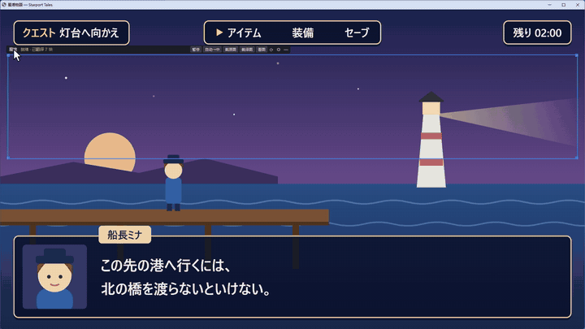
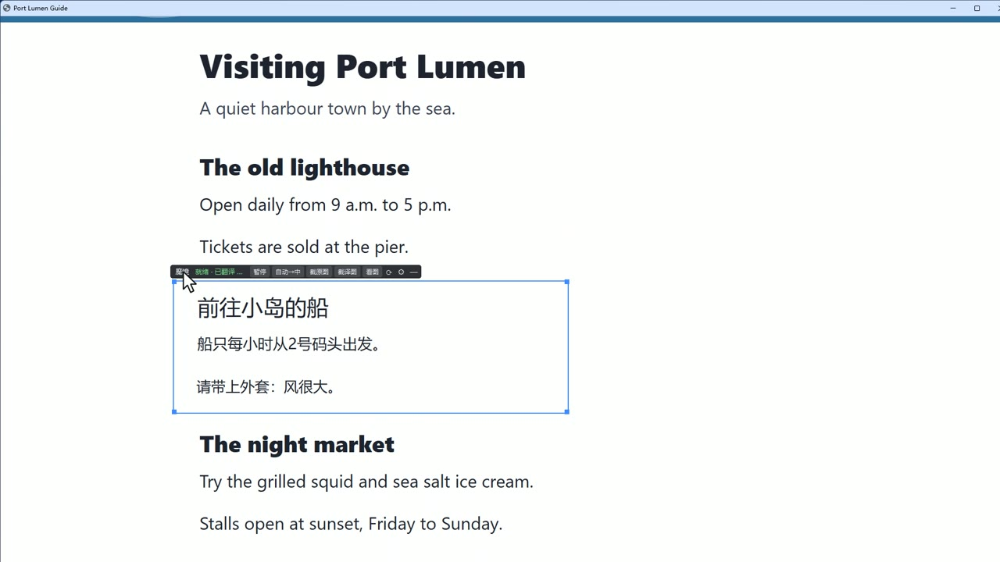
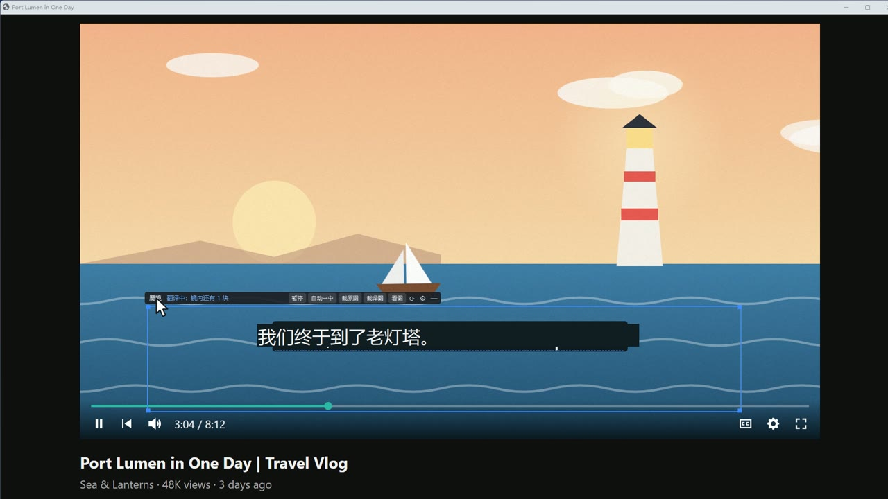
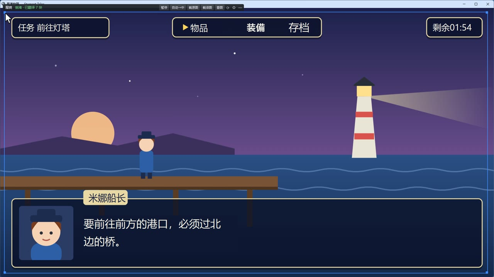
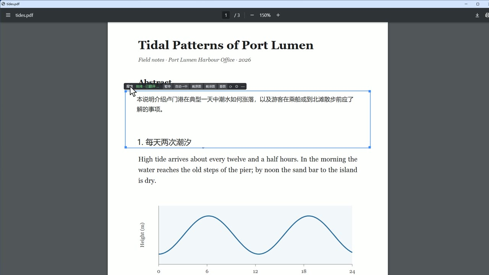
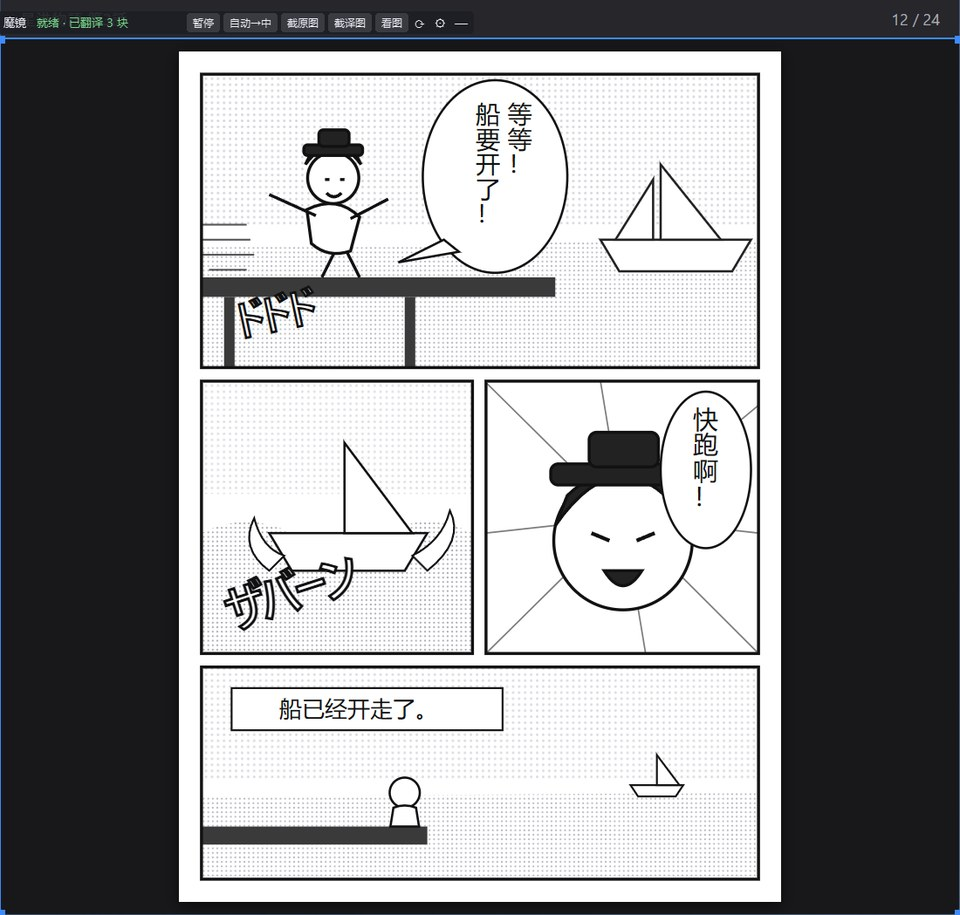

[English](README.md) · **简体中文** · [繁體中文](README.zh-TW.md) · [日本語](README.ja.md) · [한국어](README.ko.md) · [Bahasa Indonesia](README.id.md)

# 桌面魔镜 DeskMirror

Windows 上的屏幕翻译工具：在桌面上放一块可以拖动的“镜子”，镜框里同一位置的文字换成译文，镜框外照常是你的桌面。
网页、PDF、软件界面、游戏和视频字幕都用同一种方式工作，不需要浏览器插件。



第一次用？看[新手指南](docs/QUICKSTART.md)（程序第一次启动时也会弹出同样的指南），更多用法见[使用说明](docs/GUIDE.md)。

## 效果

两分半钟的介绍视频：

https://github.com/user-attachments/assets/3a04cbfd-9331-4180-9e04-9c29c09e237e

桌面魔镜在本项目测试页上的实录截图（翻译服务：DeepSeek）：

| 网页 | 视频字幕 |
|---|---|
|  |  |
| **窗口化的游戏** | **PDF** |
|  |  |

**漫画**：气泡里的竖排文字直接识别，中文译文也竖着排在原位，气泡的边框完整保留。



## 特点

- **原位显示**：译文贴在原文的位置，字号、颜色尽量和原文一致；按住 Ctrl+Alt+O 随时看原文。
- **跟得住画面**：滚动、窗口移动、遮挡、视频里的字幕都能跟上。按画面变化判断，不依赖具体软件。
- **后台预译**：魔镜所在屏幕上的文字提前翻译，拖到哪里马上显示；看过的内容不重复翻译。
- **翻译服务任选**：本机 [Ollama](https://ollama.com)（免费，文字不出本机），或 DeepSeek、通义千问、OpenAI 等 OpenAI 兼容接口。
- **隐私可控**：不翻译名单（默认排除聊天软件、密码管理器、网银；和外国同事聊天时一键打开“翻译聊天软件”）、三档预译范围、当天用量统计；屏幕上的文字默认不存盘。
- **语言随时切换**：魔镜标签上的语言按钮（如“英→中”）手动指定原文和译成的语言；支持中文、英文、日文、韩文、印尼文。
- **中英文界面**：第一次启动先选母语，译文用这种语言，界面跟着换成中文或英文；以后在设置里随时改。
- **术语**：术语表里的词必须照用；没写进术语表的词也尽量前后一致。字幕和游戏对话带上前几句作上下文，人称、语气更连贯。
- **放得下**：译文比原文长时先横向压扁一点，再借用旁边的空白，最后才缩小字号；不伸出面板边框，不盖图片和视频画面。
- **漫画**：气泡里的竖排文字直接识别，中日文译文也竖着排在原位，英文在气泡里居中。
- **看图翻译**：按 Ctrl+Alt+V 或点标签上的“看图”，把镜框里的画面交给能看图的模型来读、来翻（默认本机 Ollama 的 gemma4:12b），适合艺术字、拟声词、图片里的字。
- **收成球**：把魔镜拖到屏幕边上，它缩成一个球吸在边上、停止翻译；拖出来就接着翻，落在你松手的地方。
- **输入框翻译**：在别的软件的输入框里连按三次空格（或 Ctrl+Alt+J），把你用母语打的字换成外语；再按换回原文。默认关。
- **液态玻璃皮肤**（可选）：边框变成一圈弧形玻璃，折射后面的画面；标签和球也是玻璃。
- 还有：历史面板、改译文、多个魔镜、魔镜跟随窗口、暂停、截图、开机自启、程序内更新。

## 安装

需要：

- Windows 11（Windows 10 应该也行，但还没测过）
- 翻译服务，二选一：
  - 本机：安装 [Ollama](https://ollama.com)，再运行 `ollama pull gemma4:12b`（模型约 7.6 GB，需要显存较大的独立显卡）
  - 云端：DeepSeek 等服务的 API Key（按用量收费）

### 下载即用（推荐）

1. 在 [Releases](https://github.com/Yudreamsky/deskmirror/releases/latest) 下载 `DeskMirror-版本号-win64.zip`（约 140 MB）。
2. 解压到任意文件夹（比如“文档”或 D 盘），双击里面的 `DeskMirror.exe`，按新手指南设好就能用。
   - Windows 可能提示“Windows 已保护你的电脑”（程序没有付费签名）：点“更多信息”→“仍要运行”。
   - 设置、日志都存在这个文件夹里；换新版本时把新的解压到同一位置覆盖即可，设置会保留。
   - 不要解压到 C:\Program Files（那里写不进设置，会改存到 `%LOCALAPPDATA%\DeskMirror`）。
3. 不需要装 Python；文字识别模型（含韩文）都在包里。

### 从源码运行

1. 安装 [Python 3.12](https://www.python.org/downloads/)（安装时勾选 “Add python.exe to PATH”）。
2. 下载本项目：`git clone https://github.com/Yudreamsky/deskmirror.git`，或在 GitHub 页面下载 ZIP 解压。
3. 双击 `setup.bat`：创建 `.venv` 并安装依赖（PySide6、RapidOCR、ONNX Runtime 等，需要联网）。
4. 双击 `start.bat`。文字识别模型随安装包一起装好；第一次选“原文：韩文”时，会自动下载韩文识别模型（约 14 MB）。
5. 自己打包 exe：`.venv\Scripts\python -m pip install -r requirements-build.txt`，再运行 `.venv\Scripts\python packaging\build.py`。

用云端服务的话：新手指南第 3 步选“云端服务”，或点魔镜标签上的 ⚙ → 翻译服务，选 “OpenAI 兼容接口”，填地址、模型和 API Key，点 “测试连接”。

文字识别默认用显卡（DirectML，支持 DirectX 12 的显卡都可以），没有合适的显卡时自动改用 CPU。

## 使用

第一次启动会弹出新手指南（第 1 步选母语；以后在托盘菜单里随时能再打开），详见[新手指南](docs/QUICKSTART.md)和[使用说明](docs/GUIDE.md)。常用操作：

| 想做的事 | 怎么做 |
|---|---|
| 移动、调整魔镜 | 拖魔镜上方的标签；拖蓝色边框 |
| 临时看原文 | 按住 Ctrl+Alt+O |
| 隐藏 / 显示魔镜 | Ctrl+Alt+H |
| 把魔镜收成球 | 把标签拖到屏幕边上；点一下球就展开 |
| 把打的字换成外语 | 在输入框里连按三次空格，或 Ctrl+Alt+J（先在 设置 → 输入框翻译 里打开） |
| 液态玻璃的样子 | 设置 → 识别与显示 → 皮肤 |
| 回看刚才的字幕、对话 | Ctrl+Alt+Y 打开历史面板 |
| 暂停（框留着，不识别、不翻译） | 点标签上的 “暂停” |
| 指定语言（比如英→中、印尼→中、中→印尼） | 点标签上的语言按钮 |
| 翻译聊天软件（和外国同事、朋友聊天时） | 右键标签或托盘图标 → 勾选 “翻译聊天软件” |
| 看图翻译（漫画、艺术字、图片里的字） | Ctrl+Alt+V，或点标签上的 “看图” |
| 设置 | 点标签上的 ⚙，或右键托盘图标 |
| 更新到新版本 | 右键托盘图标 →“检查更新…” |

### 用量和省钱

- 魔镜标签上的 `↑12.3k ↓4.1k` 是今天发给翻译服务的 token（↑ 输入、↓ 输出），鼠标停上去看明细，包括命中服务商缓存的部分。
- 每次请求都会带约 430 token 的固定说明，所以最省的是少发零碎的小请求：有请求在途时，零星的新文字会等一下凑成一批再发；
  预译范围选“只翻魔镜所在的窗口”或“只翻镜框附近”，比“整块屏幕”省得多。
- 好一会儿没碰键盘鼠标就只翻镜框里的，锁屏、屏保时完全停下；云端服务默认一天最多用 100 万 token，到了就停。都在 设置 → 范围与隐私 里调。
- 每次请求记在 `logs/usage-年-月.jsonl`（只有数量和程序名，没有屏幕上的字）；命令行的 `usage --log`（见下一节）
  按程序、按批大小、按小时汇总，看钱花在哪了。

## 让 AI 帮你设置

所有设置也都能用命令行改，Claude Code、Codex 这类 AI 助手可以替你从头设置好。改完，正在运行的魔镜一秒内自动生效。

- 下载版：DeskMirror 文件夹里的 `DeskMirrorCLI.exe`；源码版：`.venv\Scripts\python -m deskmirror`。
- `config keys` 列出每项设置的说明和能取的值；`config list`、`config get`、`config set`、`config reset` 查看和修改；`service`、`models`、`test` 换翻译服务、列出模型、试一下能不能用；`usage` 看今天用了多少 token，`status` 看魔镜在不在运行。加 `--json` 输出 JSON。
- API Key 从标准输入（`config set llm.api_key -`）或环境变量（`config set llm.api_key --env DEEPSEEK_API_KEY`）读，不留在命令行里；用 Windows 账户加密保存，任何时候都只显示成 `sk-…1234`。

比如换成 DeepSeek、译成中文：

```bat
DeskMirrorCLI.exe service deepseek
DeskMirrorCLI.exe config set llm.api_key -
DeskMirrorCLI.exe config set target_lang zh-Hans first_run_tip false
DeskMirrorCLI.exe test
```

（第二行会请你粘贴 API Key，输入时不显示。）也可以直接对 AI 助手说：

> 帮我设置桌面魔镜：程序在 D:\DeskMirror，先运行 `DeskMirrorCLI.exe --help` 和 `DeskMirrorCLI.exe config keys --json` 看看能设什么。翻译服务用 DeepSeek（API Key 我给你，用 `config set llm.api_key -` 传进去），译成中文，最后用 `DeskMirrorCLI.exe test` 试一下。

## 隐私

- 用云端翻译服务时，屏幕上识别出的文字和窗口标题会发给该服务。在意的话用本机 Ollama，或在设置里缩小预译范围、添加不翻译的程序。
- API Key 用当前 Windows 账户加密（DPAPI）保存在本机的 `deskmirror.json`。
- 日志只记录耗时和数量，不记录屏幕上的文字（每次请求的用量日志还会记下文字在哪个程序里）。“记住译文”默认关闭，打开后才会把译文加密存到本机。
- 看图翻译会把镜框里的截图发给设置里的看图模型。默认是本机 Ollama，画面不出本机；改成云端服务时，每次发图前都会先问你。
- 检查更新：启动后每天最多一次向 GitHub 查最新版本号和更新说明，不发送任何屏幕内容；点了才下载。可以在设置 → 范围与隐私里关掉。

## 已知限制

- 目前只在一台电脑上测试过（Windows 11、3840×2160 / 100% 缩放、RTX 4090）。
- 独占全屏的游戏、有版权保护的视频画面无法覆盖或截取；游戏请用无边框或窗口模式。
- 艺术字、像素字、很小的字可能识别错。竖排文字要像漫画气泡那样一列列排整齐才认得好，斜着排的拟声词请用看图翻译。韩文要在语言按钮里选“原文：韩文”（换用韩文识别模型）。
- 更多见[使用说明](docs/GUIDE.md#已知限制)。

## 开发

```bat
:: 单元测试（不需要屏幕和模型）
.venv\Scripts\python.exe -m unittest discover -s tests -t .

:: 带控制台窗口运行，看日志
start.bat debug
```

## 许可证

[GPL-3.0](LICENSE)。Copyright © 2026 Yudreamsky。

用到的第三方组件和它们的许可证见 [THIRD-PARTY-NOTICES.md](THIRD-PARTY-NOTICES.md)。

## 联系

a885187@gmail.com

桌面魔镜免费开源，所有功能都能用。如果它帮到了你，可以在程序的“关于 → 打赏作者”里扫码请作者喝杯咖啡；海外用户可以用 [Ko-fi](https://ko-fi.com/dreamskyu)。
