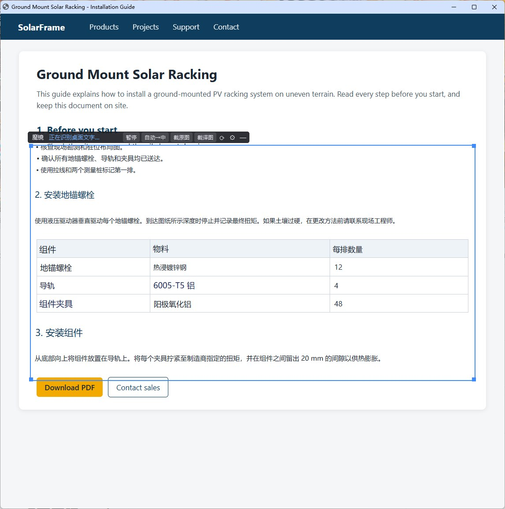

# 新手指南

第一次用桌面魔镜，照着下面 6 步走就行。程序第一次启动时也会弹出同样的指南；以后想再看：右键托盘图标（右下角蓝色“镜”字）→ **新手指南**。

## 1. 选母语

一排大按钮，每种语言用它自己的文字写：简体中文、繁體中文、English、日本語、한국어、Bahasa Indonesia。按 Windows 的语言预先选好，多数人直接点“下一步”。

- 译文会显示成你选的语言。
- 选中文（简、繁）时界面用中文，选其他语言时界面用英文。
- 以后在 设置 → 识别与显示 里可以分别改“译成”和“界面语言”。

## 2. 魔镜是什么

桌面上那个蓝色的框就是魔镜：框外是你平常的桌面，框里是同一位置换成译文的样子。

- 把魔镜拖到想看的地方就行，网页、PDF、软件、游戏、视频字幕都一样。
- 后台会提前翻译整块屏幕，所以拖到哪里，译文马上就在。
- 拖动、缩放魔镜不会重新翻译，也不会多花钱。

## 3. 选一个翻译服务

魔镜把屏幕上的文字交给翻译服务来翻，二选一：

**本机 Ollama**（免费，文字不出本机；需要显存较大的独立显卡）

1. 到 [ollama.com](https://ollama.com) 下载安装 Ollama，打开它。
2. 在命令行运行 `ollama pull gemma4:12b`（约 7.6 GB）。
3. 新手指南第 3 步会自动检查；显示“都准备好了”就行。

**云端服务**（DeepSeek、通义千问等；按用量收费，一般电脑都能用）

1. 在服务商网站申请 API Key。
2. 新手指南第 3 步选“云端服务”，选服务、填 API Key，点“测试连接”。
3. 密钥只用当前 Windows 账户加密保存在本机。

以后在 设置 → 翻译服务 里随时可以改。

## 4. 魔镜怎么用

- **移动、调整大小**：拖魔镜上方的深色标签移动，拖蓝色边框调整大小；按住 Ctrl+Alt 在镜框里任意位置拖也能移动。
- 镜框里照常能点、能选文字、能滚动，操作的是下面的软件。

标签上的按钮：

| 按钮 | 作用 |
|---|---|
| 暂停 | 框留着，不识别、不翻译（不花钱），再点一下继续 |
| 自动→中 | 指定原文和译成的语言，比如英→中、印尼→中、韩→中 |
| 截原图 / 截译图 | 截下镜框里的画面（原样 / 带译文），复制到剪贴板 |
| 看图 | 把镜框里的画面交给能看图的模型来翻：漫画、艺术字、图片里的字 |
| ⟳ | 镜框里重新识别、重新翻译 |
| ⚙ / — | 设置 / 隐藏魔镜 |

快捷键：按住 **Ctrl+Alt+O** 看原文；**Ctrl+Alt+H** 隐藏 / 显示；**Ctrl+Alt+Y** 历史（回看刚才的字幕、对话）；**Ctrl+Alt+V** 看图翻译。

右键魔镜的标签还能：再开一个魔镜、让魔镜跟着下面的窗口走。

## 5. 隐私和费用

- 用云端服务时，识别出的文字会发给它（按字数收费）；本机 Ollama 则完全不出本机。
- 聊天软件、密码管理器、网银窗口默认不识别、不翻译，可在设置里增减。和外国同事、朋友聊天时，右键魔镜的标签（或托盘菜单）勾选“翻译聊天软件”，聊完再关掉。
- 日志不记屏幕上的文字；“记住译文”默认关闭。今天发了多少字，托盘图标的提示里能看到。
- **预先翻译多大范围**：“整块屏幕”拖到哪里都马上有译文，但别的窗口里的文字也会发出去；用云端服务又在意隐私或花费时，建议选“只翻魔镜所在的窗口”（托盘菜单 → 预译范围）。

## 6. 开始用

把魔镜拖到想翻译的地方，等一两秒，译文就会出现在原文的位置。

更多用法见[使用说明](GUIDE.md)。遇到问题可以发邮件到 a885187@gmail.com。
